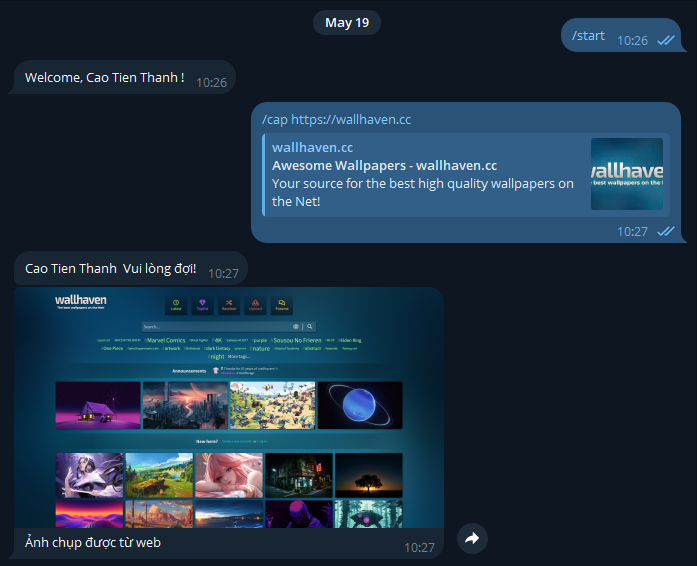
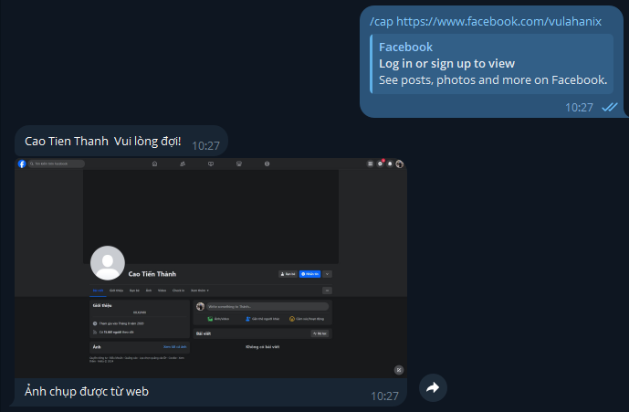

Certainly! Here's a guide in Markdown for obtaining a Telegram bot token and filling out the `config.json` file with a Facebook email and password.

# How to Obtain a Telegram Bot Token and Fill Out the config.json File

### Step 1: Obtain a Telegram Bot Token

1. Open the Telegram app and search for the `@BotFather`.
2. Start a chat with `@BotFather` and type `/start`.
3. To create a new bot, type `/newbot` and follow the instructions to name your bot and get the username.
4. After creating the bot, `@BotFather` will provide you with a bot token. Copy this token.

### Step 2: Fill Out the config.json File

1. Create a file named `config.json` in your project directory.
2. Fill in the file with the following template, replacing the placeholders with your actual bot token, Facebook email, and password:

    ```json
    {
        "token": "YOUR_TELEGRAM_BOT_TOKEN",
        "email": "YOUR_FACEBOOK_EMAIL",
        "password": "YOUR_FACEBOOK_PASSWORD"
    }
    ```

3. Save the `config.json` file.

### Example config.json

```json
{
    "token": "123456:ABC-DEF1234ghIkl-zyx57W2v1u123ew11",
    "email": "example@example.com",
    "password": "yourpassword"
}
```

---

By following these steps, you will have a properly configured `config.json` file with your Telegram bot token and Facebook credentials.

Certainly! Here's the markdown in both English and Vietnamese for running the code as per your instructions.

To run this code, you need to:
1. Install the dependencies with `npm install`.
2. After installation, simply run `npm start`.
Execute these commands in the terminal.

Note: Ensure your Telegram bot token and Facebook account details are correct to avoid errors.

---

To run this code, you need to:
1. Install the dependencies with `npm install`.
2. After installation, simply run `npm start`.
Execute these commands in the terminal.

Note: Ensure your Telegram bot token and Facebook account details are correct to avoid errors.

# Illustration Examples

Here are some illustrative images when testing the bot. The images are sourced from the "illustration" directory.





### Notes
- Never share Telegram Bot tokens and Facebook login information publicly. Please keep this information secure and private.
- Make sure your Telegram Bot is working by checking in the Telegram app.
- Make sure your Facebook login information is correct and your account isn't protected by two-factor authentication (2FA), otherwise you'll need to adjust your code to handle this authentication step.
- Linux or macOS environments are often easier to set up development tools than Windows, but the code can run on all major operating systems.
- Make sure your device has a stable Internet connection because this code needs to access Telegram and Facebook websites and services.

---

```
Once you've completed the above steps, your bot will be ready to go live and take screenshots from user-submitted URLs.
```

---

**More features will be updated soon**

---
